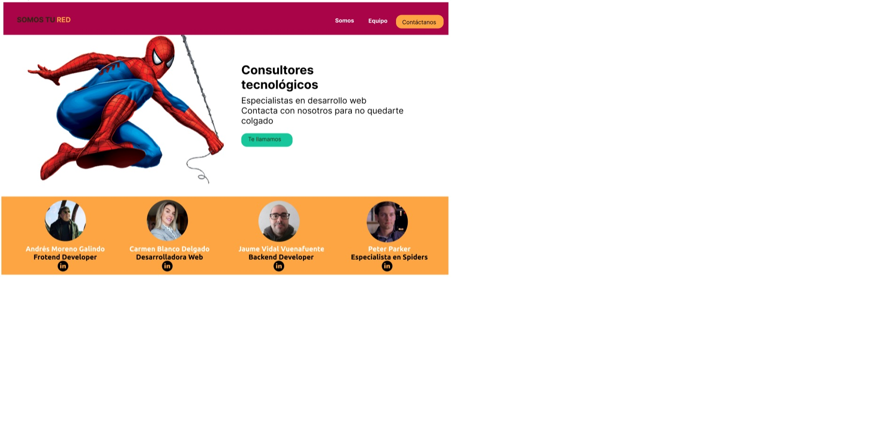
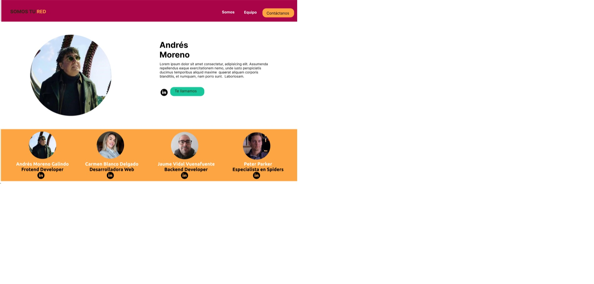
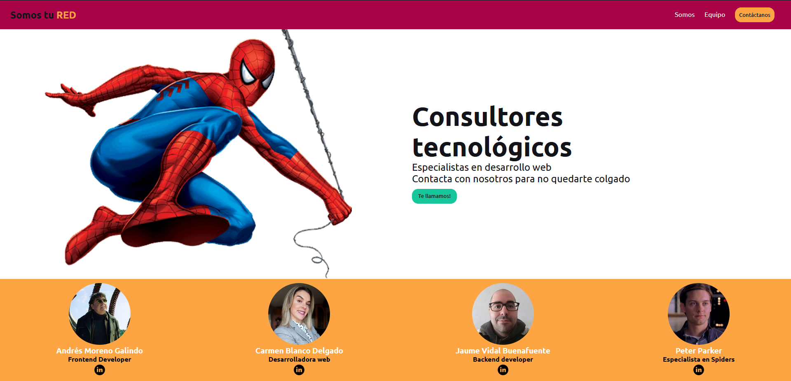
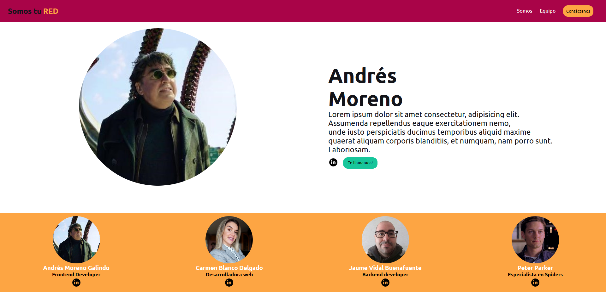

<h1>PROYECTO MYDEV TEAM</h1>

<h2>Objetivos<h2/>  
<ul>
<li>Instalar la base de nuestro entorno de desarrollo.  </li>
<li>Entender las bases del Frontend Web  </li>
<li>Entender Visual Studio Code y sus plugins (Prettier, LiveServer).  </li>
<li>Entender para qué y cómo usar herramientas de control de versiones (Git)  </li>
<li>Entender cómo usar Repositorios remotos y deploy en un servidor (Github, Github Pages)  </li>
<li>Maquetar una Web con HTML y CSS, dividir un proyecto por tareas y hacer seguimiento usando un tablero Kanban (Trello)  </li>
<li>Realizar el Readme y presentación (Demo o Sprint Review del proyecto)  </li>
<li>Trabajar con colores, bordes, imágenes, cajas, tamaños, alineaciones, FlexBox, hovers, etc… (HTML y CSS)  </li>
<li>Analizar bien las partes (componentes) de la que está compuesta la web.  </li>
</ul>

Ejemplo final:

Landing

Detalles personal

Metodología de trabajo usada:

Kanban usando Trello, para ir marcando los pasos a seguir.
https://trello.com/b/JZURp07m/my-dev-team

Sketch y mockup usando Figma.
Sketch:
  
Mockup:

Resultado del sprint:

Mob programming:

Un miembro del grupo cogía el timón y los demás observavamos, preguntando y/o ofreciendo consejos/explicaciones sobre qué y cómo seguir.

Github Pages: <a href="https://menchu02.github.io/myDevTeam">Link</a>
